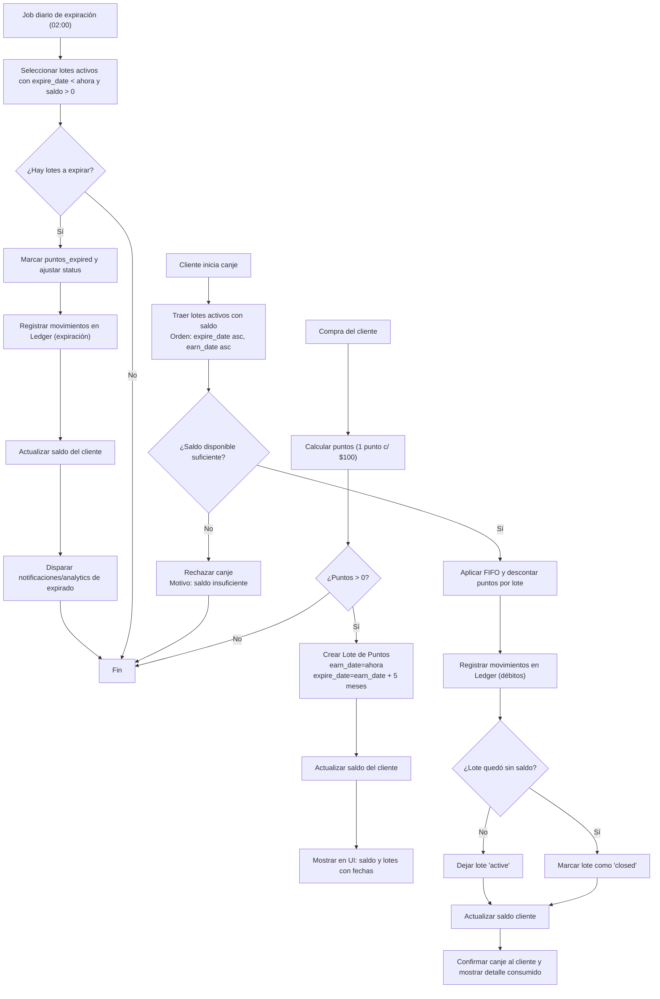

# Diagrama de Flujo 01

```mermaid
flowchart TD
  A[Compra del cliente] --> B["Calcular puntos (1 punto c/ $100)"]
  B --> C{¿Puntos > 0?}
  C -- No --> Z1[Fin]
  C -- Sí --> D[Crear Lote de Puntos<br/>earn_date=ahora<br/>expire_date=earn_date + 5 meses]
  D --> E[Actualizar saldo del cliente]
  E --> F[Mostrar en UI: saldo y lotes con fechas]

  %% Canje
  G[Cliente inicia canje] --> H[Traer lotes activos con saldo<br/>Orden: expire_date asc, earn_date asc]
  H --> I{¿Saldo disponible suficiente?}
  I -- No --> J[Rechazar canje<br/>Motivo: saldo insuficiente] --> Z1
  I -- Sí --> K[Aplicar FIFO y descontar puntos por lote]
  K --> L["Registrar movimientos en Ledger (débitos)"]
  L --> M{¿Lote quedó sin saldo?}
  M -- Sí --> N[Marcar lote como 'closed']
  M -- No --> O[Dejar lote 'active']
  N --> P[Actualizar saldo cliente]
  O --> P[Actualizar saldo cliente]
  P --> Q[Confirmar canje al cliente y mostrar detalle consumido]

  %% Expiración programada
  R["Job diario de expiración (02:00)"] --> S[Seleccionar lotes activos con expire_date < ahora y saldo > 0]
  S --> T{¿Hay lotes a expirar?}
  T -- No --> Z1
  T -- Sí --> U[Marcar puntos_expired y ajustar status]
  U --> V["Registrar movimientos en Ledger (expiración)"]
  V --> W[Actualizar saldo del cliente]
  W --> X[Disparar notificaciones/analytics de expirado]
  X --> Z1[Fin]
```
